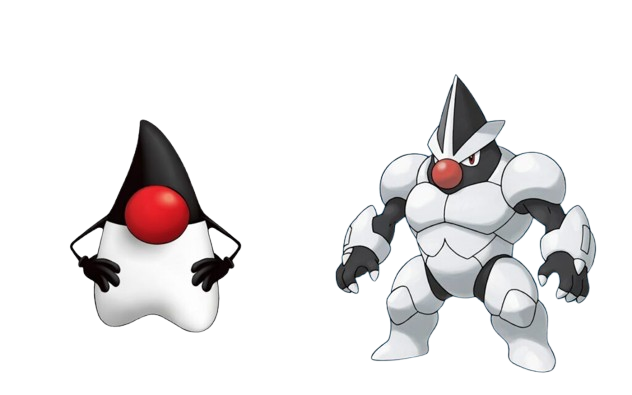
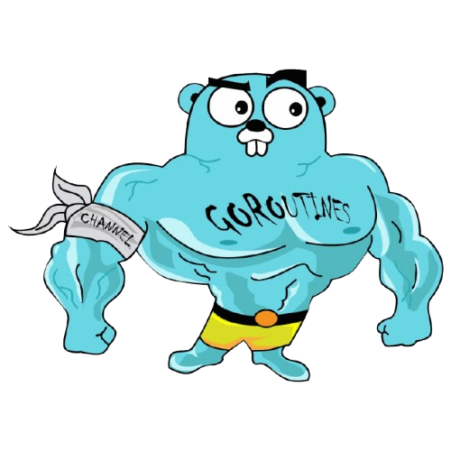

  

  <h1>Guilherme Lima</h1>

  

    <h2>Backend Software Engineer</h2>
  

<h3>
Tech Stack
</h3>

  <table width="100%">
    <tr>
      <td align="center" width="25%" valign="top">
        <b>Backend</b>  
          
        Java • Spring Boot • JPA 
        Kotlin • Go • Ruby • Rails
      </td>
      <td align="center" width="25%" valign="top">
        <b>Database</b>  
          
        PostgreSQL • MySQL • MariaDB 
        MongoDB • SQLite • DynamoDB
      </td>
      <td align="center" width="25%" valign="top">
        <b>Frontend</b>  
          
        React • Angular Tailwind CSS • CSS3
      </td>
      <td align="center" width="25%" valign="top">
        <b>Tools & Infra</b>  
          
        Git • Linux • Python
      </td>
    </tr>
  </table>

 

  
  

 

